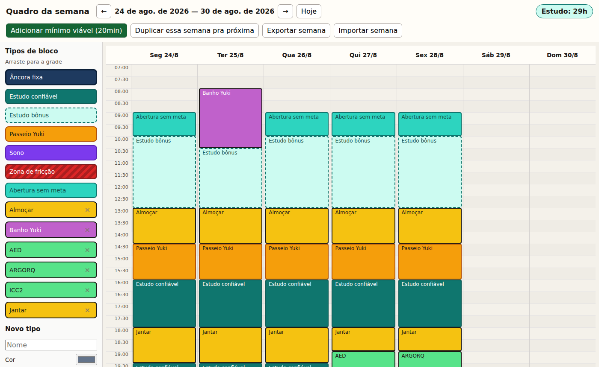
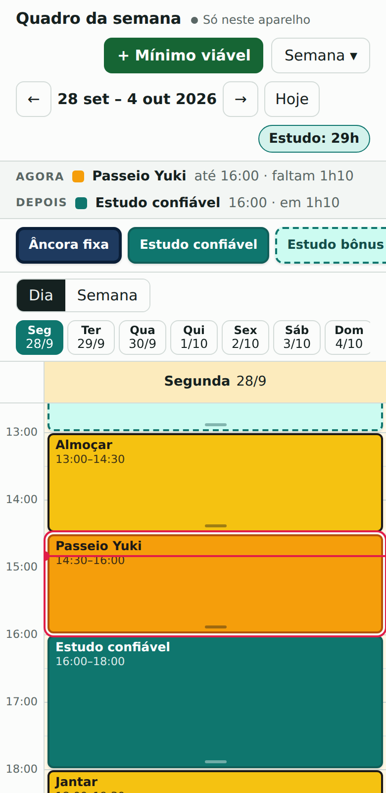

# Quadro da semana

Um cronograma semanal de arrastar e soltar que eu uso para organizar estudo, rotina e descanso. Eu monto a semana em blocos de 30 minutos, das 07:00 à 01:30, e acompanho no dia a dia pelo computador ou pelo celular.

Fiz porque os apps de agenda que testei eram pesados demais para o que eu precisava: ver a semana inteira de uma vez, mover blocos rápido e ter alguns atalhos para dias difíceis (tipo o botão de "mínimo viável").



## Funcionalidades

- **Grade semanal** de segunda a domingo, com blocos coloridos por tipo (âncora fixa, estudo, sono, refeições…)
- **Arrastar e soltar** para criar blocos a partir da paleta e mover blocos entre dias e horários, com detecção de conflito
- **Redimensionar** blocos puxando a borda de baixo
- **Tipos personalizados** com nome e cor; a cor do texto é escolhida automaticamente pelo contraste
- **Contador de horas de estudo** da semana
- **Mínimo viável**: um botão que encaixa um bloco de 20 min no primeiro horário livre depois de agora
- **Zona de fricção**: bloco com temporizador que avisa com som a hora de parar
- **Duplicar semana** para a próxima, e **exportar/importar** tudo em JSON
- Dados salvos no navegador (`localStorage`), sem backend

## Versão sincronizada (`artifact/`)

Em `artifact/quadro-da-semana.html` fica uma segunda versão, feita para usar em qualquer aparelho:

- **Sincroniza** entre celular e computador (roda como Artifact no claude.ai, com banco de documentos da própria plataforma)
- **Pensada para o celular**: visão por dia, colocar blocos com toque, arrastar com toque longo e editar texto, dia, horário e duração numa janela
- **Agora / Depois**: mostra o bloco atual, o próximo e quanto tempo falta, com uma linha marcando a hora atual
- **Modo escuro** automático
- Correções em relação à versão original:
  - a importação mescla as semanas em vez de apagar as outras;
  - o "mínimo viável" depois da meia-noite entra na noite certa;
  - remover um tipo não deixa blocos órfãos.



## Tecnologias

- HTML, CSS e JavaScript puros, sem frameworks, sem build e sem dependências
- Drag and drop nativo (HTML5) na versão original; Pointer Events na versão sincronizada, para funcionar com mouse e toque
- Web Audio API para o alarme do temporizador

## Como rodar

Não precisa instalar nada. Clone o repositório e abra o `index.html` no navegador:

```bash
git clone https://github.com/davivi-py/cronograma-semanal.git
cd cronograma-semanal
# abra index.html no navegador (duplo clique já funciona)
```

Para ver com dados de exemplo, clique em **Importar semana** e escolha o arquivo em `semanas-json/`.

## Estrutura

```
index.html                  página da versão original
app.js                      estado, grade, arrastar e soltar, timer, importar/exportar
styles.css                  estilos
artifact/
  quadro-da-semana.html     versão sincronizada e adaptada para o celular (página única)
semanas-json/               exemplo de semana exportada
docs/                       capturas de tela
```

## Formato dos dados

A exportação é um JSON com os tipos e os blocos de cada semana, identificada pela data da segunda-feira:

```json
{
  "version": 1,
  "weekStart": "2026-08-24",
  "types": [{ "id": "estudo", "name": "Estudo confiável", "color": "#0f766e" }],
  "weeks": {
    "2026-08-24": [
      { "id": "…", "typeId": "estudo", "day": 0, "slot": 18, "minutes": 120, "text": "Estudo confiável" }
    ]
  }
}
```

`day` vai de 0 (segunda) a 6 (domingo), e `slot` é o índice do horário de início em passos de 30 min a partir das 07:00.
